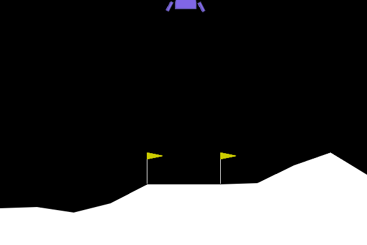
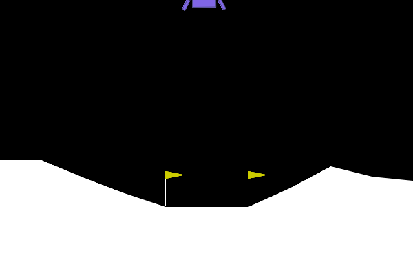
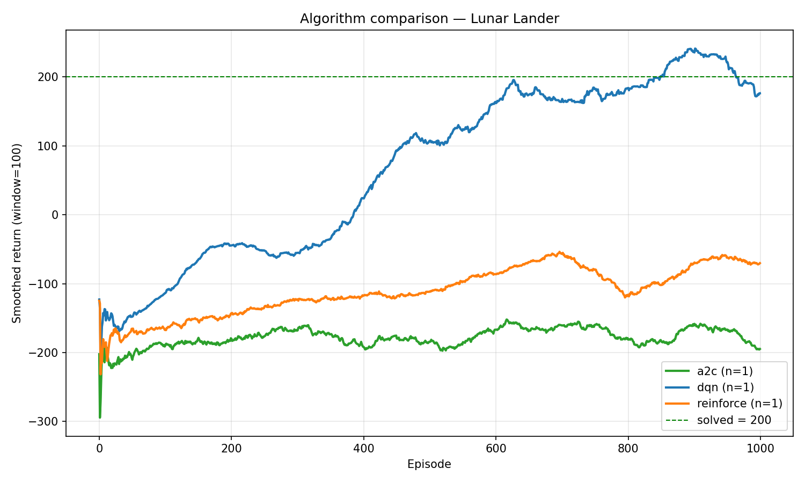
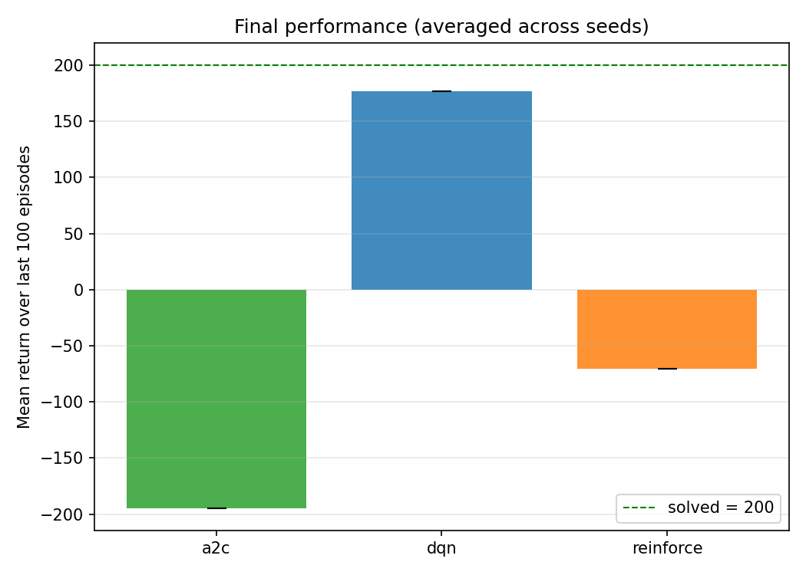

# RL Agents Benchmark — LunarLander Report

Benchmark comparing three RL agents on `LunarLander-v3` using a shared
environment/logging contract:

- `DQN`
- `REINFORCE`
- `A2C` (actor + critic)

All current published results in this branch are aligned on:

- seed set: `[42]`
- episode budget: `1000`
- common log schema: `episode,reward,length,loss`

## Evaluation Summary

From `results/report/summary.md`:

| Algorithm | Seeds | Final return (mean ± std) | Convergence ep. (>=200) | Stability (per-seed std) |
|---|---|---|---|---|
| A2C | 1 | -194.76 ± 0.00 | never (0/1) | 109.30 |
| DQN | 1 | 176.41 ± 0.00 | 850 ± 0 (1/1) | 173.82 |
| REINFORCE | 1 | -70.19 ± 0.00 | never (0/1) | 85.51 |

Artifacts:

- Report: `results/report/summary.md`
- Plots: `results/plots/`
- Gameplay demos: `results/gifs/`

## Gameplay Demos

### DQN



### REINFORCE



### A2C


## Training Curves




## Reproduce

```bash
# Tests
python -m pytest

# Rebuild evaluation outputs
python -m evaluation report

# Re-record gameplay GIFs
python -m evaluation play --algo dqn --checkpoint results/dqn/model.pth --gif results/gifs/dqn_demo.gif --demo-trials 16
python -m evaluation play --algo reinforce --checkpoint results/models/reinforce_policy.pth --gif results/gifs/reinforce_demo.gif --demo-trials 16
python -m evaluation play --algo a2c --checkpoint results/models/a2c_actor.pth --hidden 256 --gif results/gifs/a2c_demo.gif --demo-trials 16
```

## Project Structure

- Shared env contract: `src/env_utils.py`
- Env sanity tests: `tests/test_env.py`
- Evaluation package: `evaluation/`
- DQN training implementation: `dqn/src/DQN/`
